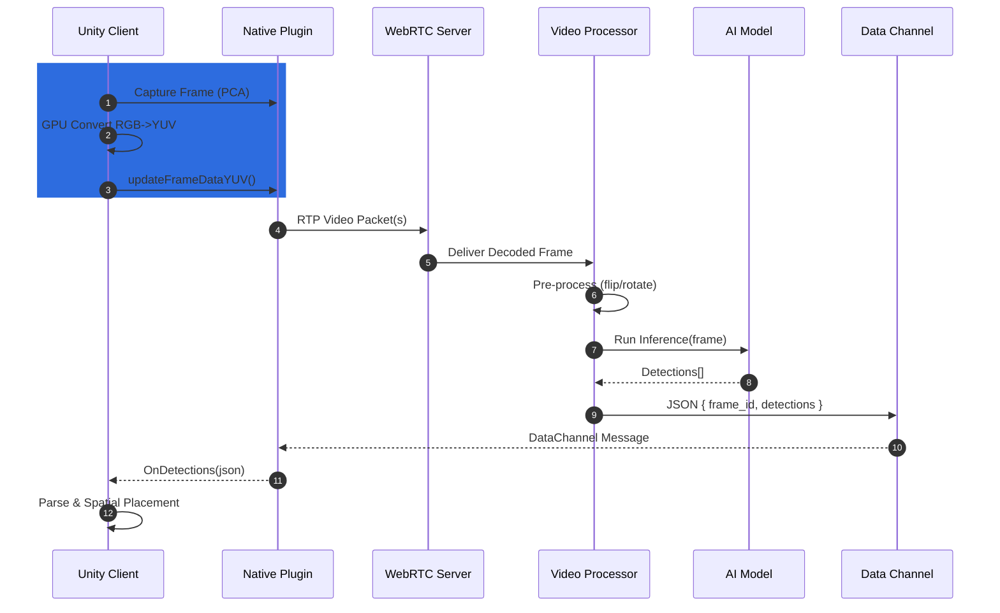
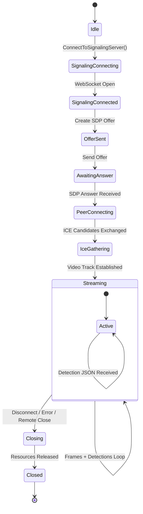
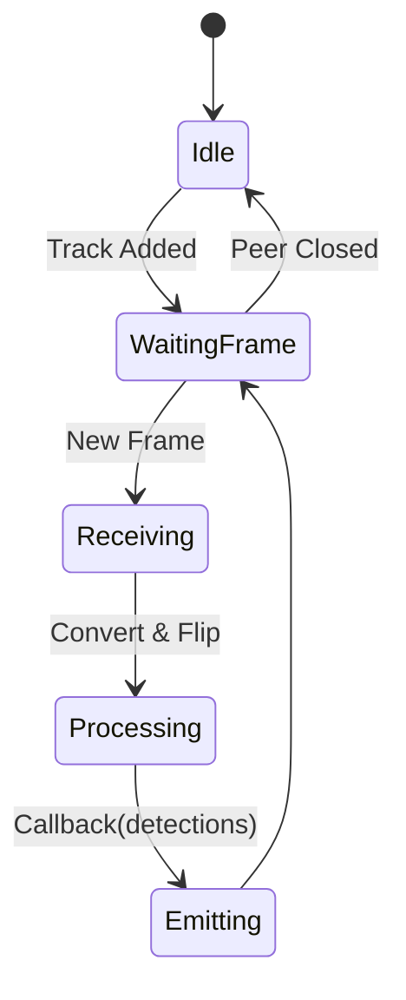
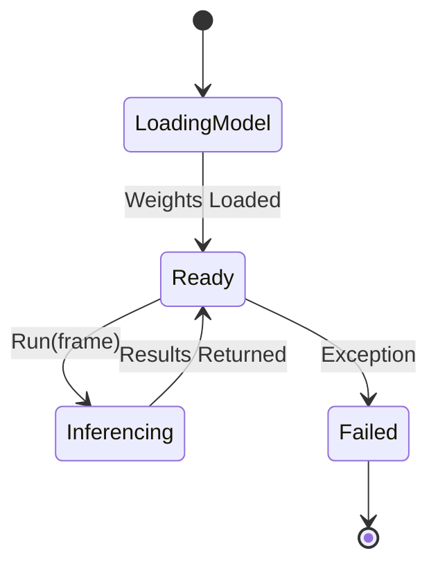
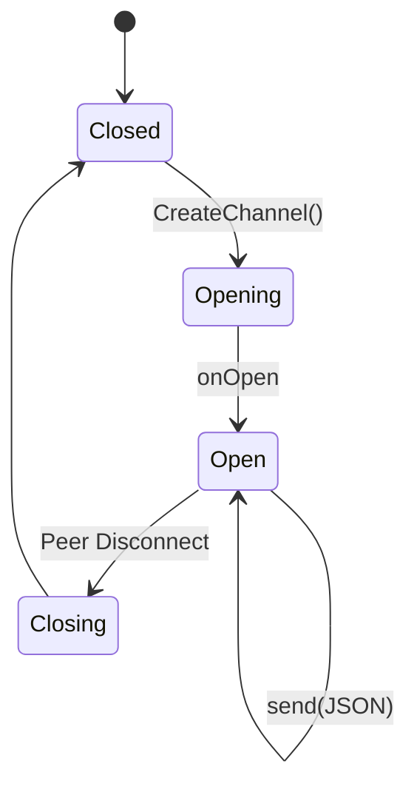
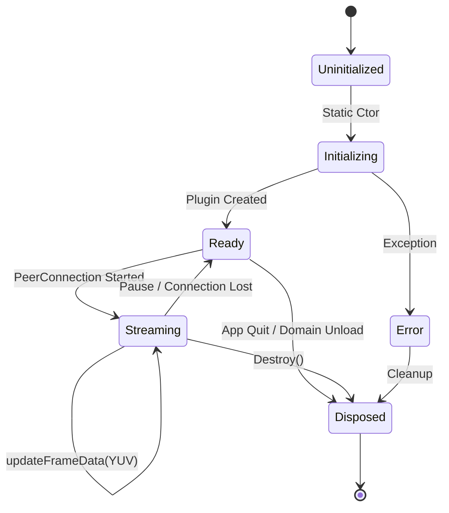
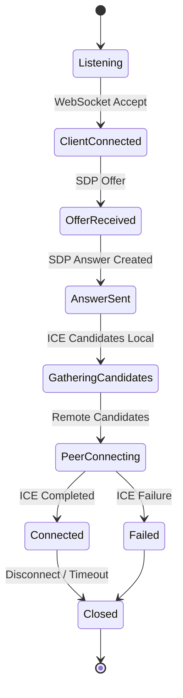

# Architecture Diagram & Component Responsibilities

## System Diagram

```text
+-------------------+         WebRTC Video/Data         +--------------------------+
|   Meta Quest      | <-------------------------------> | QuestVisionStreamServer  |
|  (Unity Client)   |                                   |   (Python Server)        |
|                   |                                   |                          |
| +---------------+ |                                   | +----------------------+ |
| | PCA Camera    | |                                   | | WebRTC Signaling     | |
| | PCAVideoStreamer|                                   | | Video Processor      | |
| | FrameSender   | |                                   | | AI Detectors         | |
| | QuestVisionStream|                                   | | (YOLO, Florence2,    | |
| | Bridge        | |                                   | |  GroundingDINO, etc.)| |
| | Events        | |                                   | | Data Channel         | |
| +---------------+ |                                   | +----------------------+ |
+-------------------+                                   +--------------------------+
```

## Component Responsibilities

### Meta Quest (Unity Client)

- **PCA Camera**: Captures passthrough frames from headset cameras.
- **PCAVideoStreamer**: Manages frame capture, WebRTC setup, and streaming.
- **FrameSender**: Converts frames to YUV format using GPU compute shaders for efficient streaming.
- **QuestVisionStreamBridge**: Interfaces with native Android plugin for WebRTC and frame transmission.
- **QuestVisionStreamEvents**: Handles UnityEvents for connection, video, and detection results.

### QuestVisionStreamServer (Python)

- **WebRTC Signaling**: Manages peer connection negotiation and ICE/STUN/TURN configuration.
- **Video Processor**: Handles frame pre-processing (flip, rotate, etc.) and conversion for AI models.
- **AI Detectors**: Runs inference using YOLO, Florence2, GroundingDINO, etc. Returns detection results.
- **Data Channel**: Sends detection results (JSON) back to Unity client for spatial operations.

## Data Flow

1. **Frame Capture**: Unity captures and processes camera frames.
2. **Frame Shipping**: Frames are streamed to the server via WebRTC video track.
3. **AI Inference**: Server processes frames and runs selected AI model.
4. **Detection Shipping**: Server sends detection results via WebRTC data channel.
5. **Spatial Operations**: Unity uses detection data for object placement and interaction.

## Mermaid Architecture Diagram

```mermaid
flowchart LR
 subgraph U[Meta Quest (Unity Client)]
  A[PCA Camera]
  B[PCAVideoStreamer]
  C[FrameSender\n(YUV Conversion)]
  D[QuestVisionStreamBridge\n(Native Plugin Interface)]
  E[QuestVisionStreamEvents]
 end

 subgraph S[QuestVisionStreamServer (Python)]
  F[WebRTC Signaling & PeerConnection]
  G[Video Processor\n(OpenCV Pre-processing)]
  H[AI Detectors\nYOLO / Florence2 / etc]
  I[Data Channel Sender]
 end

 A --> B --> C --> D
 D -- WebRTC Offer/Answer + ICE --> F
 D -- Video Track (YUV Frames) --> G
 G --> H
 H --> I
 I -- JSON Detections --> D
 D --> E

 classDef unity fill:#2d6cdf,stroke:#1b3f73,stroke-width:1,color:#fff;
 classDef server fill:#673ab7,stroke:#3f256d,stroke-width:1,color:#fff;
 class A,B,C,D,E unity;
 class F,G,H,I server;
```

 ## Mermaid Sequence Diagram (End-to-End Flow)

 ```mermaid
 sequenceDiagram
  autonumber
  participant Unity as Unity Client<br/>PCAVideoStreamer
  participant Bridge as Native Plugin<br/>QuestVisionStreamBridge
  participant Signal as Signaling / WebSocket
  participant Server as WebRTC Server<br/>PeerConnection
  participant VP as Video Processor
  participant Detector as AI Detector
  participant DC as Data Channel

  Unity->>Bridge: Configure (FPS, Resolution, ICE, TURN)
  Unity->>Bridge: ConnectToSignalingServer(url)
  Bridge->>Signal: WebSocket connect
  Signal-->>Bridge: ACK

  Bridge->>Signal: Send SDP Offer
  Signal->>Server: Forward Offer
  Server->>Signal: SDP Answer
  Signal->>Bridge: Deliver Answer
  Bridge->>Unity: OnPeerConnectionStarted

  loop ICE Gathering
   Bridge->>Signal: ICE Candidate
   Signal->>Server: ICE Candidate
   Server->>Signal: ICE Candidate
   Signal->>Bridge: ICE Candidate
  end

  Unity->>Bridge: Frame (RenderTexture)
  Unity->>Unity: GPU Convert RGB -> YUV (FrameSender)
  Unity->>Bridge: updateFrameDataYUV(Y,U,V,width,height)
  Bridge->>Server: WebRTC Video RTP Packets
  Server->>VP: Deliver Encoded Frame
  VP->>VP: Pre-process (flip/rotate)
  VP->>Detector: Invoke(frame)
  Detector-->>VP: Detections (labels, bboxes, scores)
  VP->>DC: JSON { frame_id, detections[] }
  DC-->>Bridge: DataChannel Message
  Bridge-->>Unity: OnDetections(json)
  Unity->>Unity: Parse & Spatial Placement

  alt Connection Closed
   Server-->>Bridge: connectionState=closed
   Bridge-->>Unity: OnPeerConnectionClosed
  end
 ```

---
For further details, see the other documentation files in this folder.

## Mermaid Sequence Diagram (Detections Focus)



## Mermaid State Diagram (Connection Lifecycle)



## Mermaid Activity Diagram (Frame to Detection Pipeline)

```mermaid
flowchart TD
    A[Capture Frame (PCA)] --> B[GPU YUV Conversion]
    B --> C[Send YUV Over WebRTC]
    C --> D[Receive RTP Frame]
    D --> E[Pre-process (flip/rotate)]
    E --> F[Run Detector]
    F --> G{Detections Found?}
    G -- Yes --> H[Build JSON Payload]
    G -- No --> I[Optional: Empty Result]
    H --> J[Send DataChannel Message]
    I --> J
    J --> K[Unity OnDetections Event]
    K --> L[Spatial Mapping / Visualization]
```

## Component State Expansion: Video Processor



## Component State Expansion: Detector



## Component State Expansion: Data Channel



## Component State Expansion: Unity Bridge (Native Plugin Interface)



## Component State Expansion: Signaling Server / Negotiation


