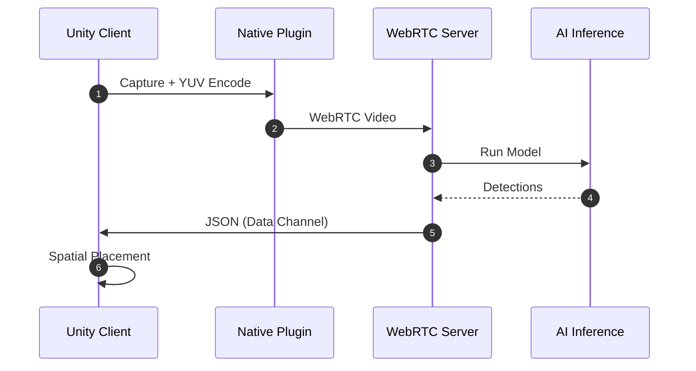

# QuestVisionStream Documentation Index

## Overview

QuestVisionStream enables real-time computer vision for Meta Quest by streaming passthrough camera frames from Unity to an external GPU server (Python) via WebRTC, performing AI inference (YOLO / Florence2 / others), and returning detection metadata for spatial placement and interaction inside the headset.

## Quick Navigation

- [End-to-End Overview](EndToEndOverview.md)
- [Architecture & Diagrams](ArchitectureDiagram.md)
- [Unity Client Component](UnityClient.md)
- [Server Component](QuestVisionStreamServer.md)
- [Message Transmission & Schemas](MessageTransmissionGuide.md)

## High-Level Flow



## Core Concepts

### Why WebRTC?

- Low latency bidirectional channel (video + data)
- NAT traversal with ICE/STUN/TURN
- Efficient media handling (hardware assisted)

### Performance Considerations

- GPU compute shader YUV conversion reduces CPU overhead
- Frame rate & resolution configurable
- Data channel returns only essential JSON payload per frame

### Detection Payload (Schema)

```json
{
  "frame_id": 42,
  "detections": [
    { "label": "person", "confidence": 0.97, "bbox": [x, y, w, h], "center": [cx, cy] }
  ]
}
```

## Document Summaries

| Document | Purpose |
|----------|---------|
| EndToEndOverview.md | Narrative of full pipeline and interactions |
| ArchitectureDiagram.md | Visual diagrams (architecture, sequences, states) |
| UnityClient.md | Unity-side responsibilities & APIs |
| QuestVisionStreamServer.md | Server-side modules & workflow |
| MessageTransmissionGuide.md | Message schemas, transport and parsing |

## Getting Started (Abbreviated)

1. Run server (see full instructions in main README).
2. Configure `PCAVideoStreamer` prefab with secure signaling URL (`wss://`).
3. Deploy to device, observe detection events via `QuestVisionStreamEvents`.

## Troubleshooting Pointers

- No detections? Check model selection and data channel open state.
- Latency spikes? Lower resolution or FPS; verify TURN usage only when necessary.
- Connection fails? Ensure `wss://` proxy (e.g., ngrok) and STUN reachability.

## Next Steps

- Extend detectors folder with custom model
- Add custom data channels for control signals
- Attach world anchors to detection-driven spawned objects

---

Return to: [Architecture & Diagrams](ArchitectureDiagram.md) | [Unity Client](UnityClient.md)
