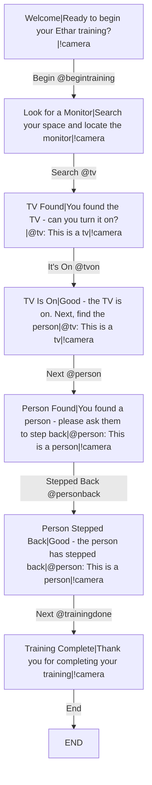

# Ethar Training Demo — Extended

The demo flow extended with **UX confirmation steps**: after each detection
the trainee confirms a real-world action (turn the TV on, ask the person to
step back) while the world label **keeps tracking the detected object**
across the button press. Detections and button presses both advance the flow,
exactly as in the base scenario.

Pattern notes (see the step table below):

- **Confirm steps** (`foundtv → tvon`, `person → personback`): the result is a
  synthetic token, so **only the button** advances — but the step re-declares
  the same `@class` label, so the indicator stays on the object, re-placed on
  every fresh sighting.
- **Hand-off steps** (`tvon → person`): the result is a detector class, so the
  flow advances on the **real detection** (the button is a manual override).
- **The final step declares no `@class`** — the state machine clears its
  cached detected class on activation, so all labels come down and stale
  sightings cannot resurrect them.

## Steps

| # | Step | Waits for | Advanced by | Options | Result | World label |
|---|------|-----------|-------------|---------|--------|-------------|
| 1 | Welcome | *(begin)* | button | Begin | `begintraining` | — |
| 2 | Look for a Monitor | `begintraining` | **`tv` detection** (Search = override) | Search | `tv` | — |
| 3 | TV Found | `tv` | button (confirm) | It's On | `tvon` | `tv`: This is a tv |
| 4 | TV Is On | `tvon` | **`person` detection** (Next = override) | Next | `person` | `tv`: This is a tv *(label retained across the press)* |
| 5 | Person Found | `person` | button (confirm) | Stepped Back | `personback` | `person`: This is a person |
| 6 | Person Stepped Back | `personback` | button | Next | `trainingdone` | `person`: This is a person *(label retained)* |
| 7 | Training Complete | `trainingdone` | button | End | *(complete)* | — *(labels cleared)* |
| 8 | *(END)* | — | — | — | — | — |
